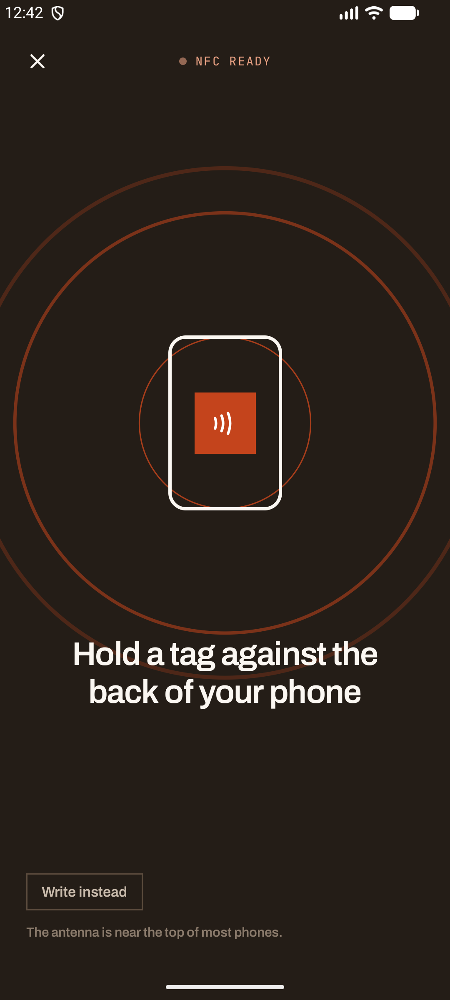
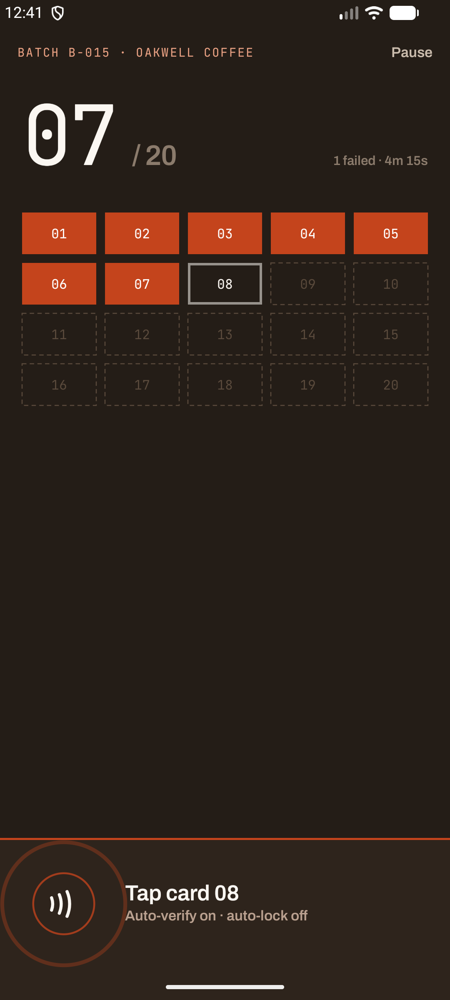
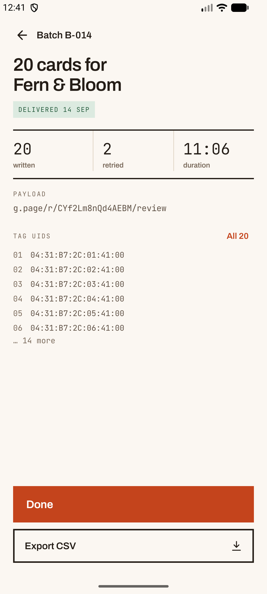
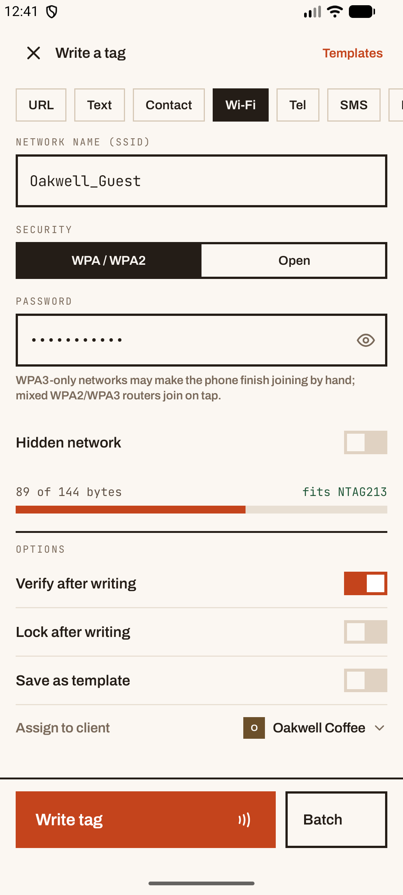
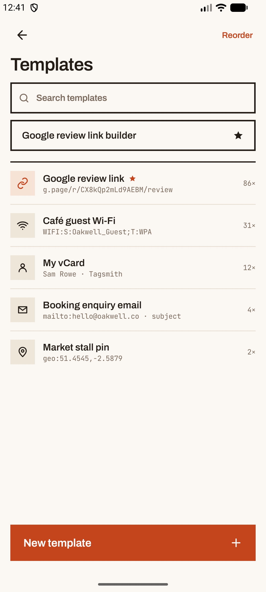
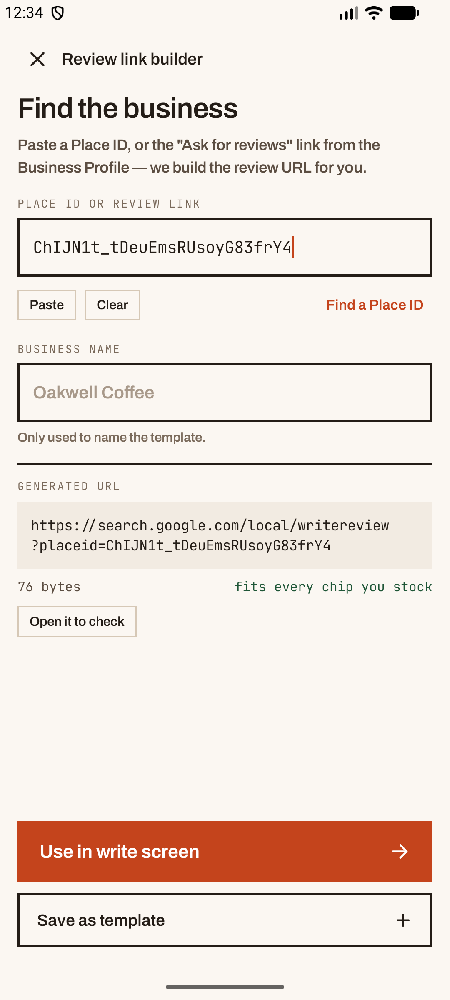
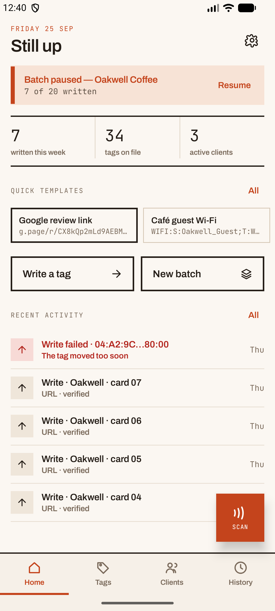
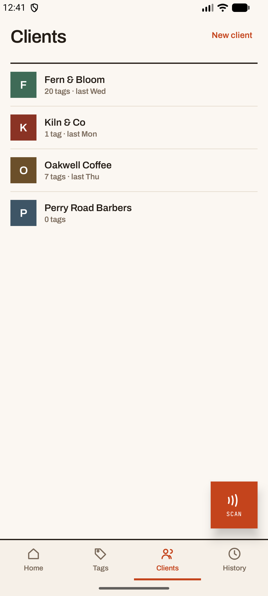
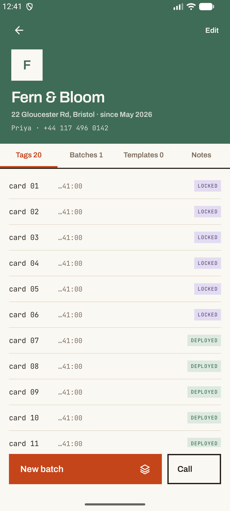

# Tagsmith

An Android app for programming and managing NFC tags, built for someone who sells
NFC products to local businesses: write a review link to a card, keep track of what
went where, and look up any tag by tapping it.

The emotional centre of the app is the tap. Everything else is support around that
one moment.

This repository is **v2** of the build plan. v1 was the tap itself — scan, tag
details, writing URL and text, history, settings, the error states that bite. v2 adds
the business around it: **templates, clients, batch mode, and every payload type** the
brief lists.

## Screenshots

<p align="center">
  
  
  
</p>
<p align="center">
  <em>The tap owns the dark ground · a batch of twenty without leaving the screen · what went in the box, and when</em>
</p>

<p align="center">
  
  
  
</p>
<p align="center">
  <em>Ten payload types, sized in real NDEF bytes · saved payloads, favourites first · the review link, the thing written most</em>
</p>

<p align="center">
  
  
  
</p>
<p align="center">
  <em>Home picks up where you left off · the businesses supplied · which card went where</em>
</p>

A note on how these were taken, since it affects what you are looking at: NFC
cannot be emulated, so the screens show **seeded sample data** — clients, templates,
two batches — and the tap screens were captured with the radio forced to report
ready. Every pixel is the real app rendering real state, but no physical tag was
involved. See **Known limits**.

## Running it

```bash
./gradlew :app:installDebug                 # a device with an NFC radio, or an emulator for the UI
./gradlew :app:testDebugUnitTest            # encoders, review links, the payload codec — JVM, no device
./gradlew :app:connectedDebugAndroidTest    # the ledger and the v1→v2 migration — needs a device or emulator
./gradlew :app:assembleRelease              # R8-minified
```

`local.properties` points at the Android SDK. `compileSdk`/`targetSdk` are 37,
`minSdk` is 26.

NFC cannot be emulated. On an emulator the app runs and every screen is reachable,
but the radio reports as absent and the scan screen shows its dead-end state — which
is itself one of the states worth looking at.

## What it does

| Area | State |
| --- | --- |
| Onboarding | Three slides, skippable, with the NFC-off and no-hardware variants; the last adds a first client |
| Home | Resume-batch banner, stat row, quick templates, recent activity |
| Scan | Waiting → detected → reading → result sheet → errors |
| Tag details | Identity, capacity, decoded records (contacts and networks as cards), provenance, assign client |
| Write | Ten payload types, byte counter, verify / lock / save-as-template, client, hand-off to batch |
| Templates | Search, favourite, reorder, duplicate, delete; one tap from Home to a loaded write screen |
| Review link builder | Place ID or Business Profile link → review URL, sized and savable |
| Clients | List, detail with tags / batches / templates / notes, editor with logo and colour |
| Batch | Setup, a running screen that stays armed between cards, pause and resume, summary, delivery, CSV |
| Lock · Erase | The heavy hold-to-confirm lock screen; erase to an empty NDEF message |
| History | Day-grouped ledger, filters by range, action, client and failure; detail; CSV export |
| Settings | Theme, haptics, sounds, default payload type and client, write defaults, clear history |
| Share target | Share a URL from any app and land in Write with it prefilled |

**Tags** keeps its place in the bottom bar and explains what is coming — the
inventory is v3, though every tag read or written is already being recorded for it.

### Payload types

| Type | On the tag | What a phone does on tap |
| --- | --- | --- |
| URL | URI record | Opens the link |
| Text | Text record | Shows the text |
| Contact | vCard 3.0 (`text/vcard`) | Offers to save the contact |
| Wi-Fi | Wi-Fi Simple Config (`application/vnd.wfa.wsc`) | Android offers to join the network |
| Tel · SMS · Email | `tel:` · `sms:?body=` · `mailto:?subject=&body=` | Opens the dialler, messages or mail, filled in |
| Location | `geo:lat,lng`, or `geo:0,0?q=address` | Opens the maps app |
| App | Android Application Record | Opens the app, or its Play Store page |
| Raw | Any MIME type, text or hex | Whatever handles that type |

The byte counter is the real encoded size, framing included. A contact card with
every field filled is bigger than an NTAG213, and the screen says so before you tap.

## Design

The screens come from the `Tagsmith Screens` handoff: Material 3 structure on a warm
workshop palette — oak and paper neutrals with one ember accent (`#C4441C`), Archivo
throughout, JetBrains Mono wherever the screen shows data, and Modernist's flush-left
labels and hard 2px rules as the organising grammar.

Rules worth keeping when you extend it:

- **Nothing rounds a corner.** Radius is 0 on purpose — even the bottom sheets are
  squared off. Only circles and the phone silhouette are curved.
- **Button labels are flush left**, even when the button is wider than its label. The
  trailing icon sits at the far right.
- **Primary actions live in the bottom third**, within thumb reach — this is operated
  one-handed, standing up, in a café.
- **Data is mono.** UIDs, byte counts, chip types and payload previews read as data.
- **The tap owns the dark ground.** Scan, the tap prompt and batch mode render on the
  dark field whatever the app theme is; `OnTapGround { }` does this, status bar
  included.
- **Motion carries meaning.** Rings pulse while waiting, collapse on detection, and
  resolve into a check that draws itself in. In a batch, each card pops as it lands.
- **Each client has a colour.** It runs across their page and marks their tags, from a
  palette of dark earth tones that all carry paper-coloured text.

Colours are semantic roles on `Tagsmith.colors` (`ink`, `accent`, `rule`, `hairline`,
`danger`, …) rather than raw hex at the call site. Type is `TagsmithType`, named for
where a style is used rather than for its size.

## Architecture

Hand-wired dependencies, built in `AppContainer` and handed down through
`LocalAppContainer`. A DI framework would cost more than it saves at this size.

```
core/nfc/       NfcSession (the state machine), TagReader, TagWriter, failures
                Payloads, PayloadEncoders (vCard, Wi-Fi, URIs), PayloadCodec, ReviewLink
core/data/      Room: tags, history, clients, templates, batches
                LedgerRepository, ClientRepository, TemplateRepository, BatchRepository
core/settings/  DataStore-backed preferences
core/feedback/  Haptics and tones
ui/payload/     PayloadDraft and the ten payload forms, shared by Write, templates and batch
ui/theme/       The palette, the type scale, OnTapGround
ui/components/  Rules, kickers, chips, fields, sheets, meters, the rings, the drawn check
ui/<screen>/    One package per screen, ViewModel beside it
ui/nav/         Routes, the bottom bar, the single NavHost
```

### The session

`NfcSession` is the whole tap, as a state machine:

```
Idle → Waiting(op) → Detected(op) → Working(op) → Done(result) | Failed(op, failure)
```

Screens `arm()` it with a `TagOperation` (`Read`, `Write`, `Lock`, `Erase`, `Format`)
and watch `phase`. Every phase carries the operation it belongs to, so a screen draws
only its own taps — a result left over from a write never appears on the scan screen.

`MainActivity` owns the radio. It mirrors `session.armed` into
`NfcAdapter.enableReaderMode`, which is deliberate: reader mode suppresses the
platform's own NDEF handling, so tapping a URL tag inside Tagsmith never bounces the
operator out into a browser.

### Batch mode

A batch arms the session in **continuous** mode: each result goes out as an event and
the session goes straight back to waiting, without ever leaving reader mode. That
matters — if the radio were switched off and on between cards, a card still resting
on the phone would be discovered afresh and written twice.

The same card presented twice is refused before any IO. The write operation carries
the batch's written UIDs, and a match fails as `AlreadyInBatch` without the radio
touching the tag — so a card is never counted twice, and never re-locked.

A batch's clock only runs while its screen is open. Leaving pauses it; Home offers it
back; a process killed mid-batch is settled as paused at its last written card.

### The ledger

Every completed tap is recorded once, in `AppContainer`, by a collector on
`session.events`. Screens never write history themselves. One transaction covers the
tag, the history row, the template's use count and the batch counter, so a batch can
never show a card as written without the ledger agreeing.

History keeps the client's name as it was at the time — renaming or deleting a client
later does not rewrite last month's entries.

### Errors

`NfcFailure` carries the copy the screen shows, not just a code: a kicker, a headline
and a line of detail, plus whether it is recoverable. `TagWriter` maps the radio's
exceptions onto it, so `TagLostException` becomes "The tag moved too soon" at the one
place that knows the difference.

### Chip detection

`TagReader` asks NTAG chips for `GET_VERSION` (`0x60`) and reads the storage byte,
which is the only reliable way to tell a 213 from a 215 before reading anything. It
falls back to `MifareUltralight.getType()` and then to `Ndef.maxSize`.

### Upgrading from v1

The database moved from schema 1 to 2 with a Room auto-migration. Every tag and history
row is kept; tags and history gain client and batch links; the new tables start empty.
v1's free-text client column on tags is dropped — nothing in v1 could set it, so it was
always empty. `MigrationTest` runs the real migration against the exported v1 schema.

## Tests

- **Unit (JVM):** vCard encoding and decoding, the Wi-Fi credential's byte layout
  checked against how Android's parser reads it, the `tel` / `sms` / `mailto` / `geo`
  builders, hex parsing, review-link parsing, and a round trip of every payload type
  through the codec.
- **Instrumented:** the v1 → v2 migration, and the ledger — a batch counting, naming
  and closing; a card after the batch is full; failures as retries; pausing the clock;
  delivery; deleting a client; and a write whose read-back comes back stale.

## Known limits

- **No NFC operation has been run against a physical tag.** Read, write, verify,
  lock, erase, batch and every failure path are written, and the ledger side of them
  is tested, but the emulator has no radio. The first real test is an NFC phone and
  a stack of NTAG215s.
- **The review link builder does not search.** Finding a business by name needs a
  Google Places API key, so it takes a Place ID or an existing review link instead,
  and links to Google's Place ID finder.
- **Wi-Fi: WPA and open networks only.** Android's tap-to-join doesn't handle WEP,
  and no NFC Wi-Fi standard carries a hidden-network flag — the toggle is saved with
  the template and says so, but a phone can only join a network it can see.
- **Inventory, export and import are v3.** The Tags tab, Settings → Export JSON and
  Import are not built; History and batches have their own CSV export.
- **The success screen's `uid`** is the tag just written, read back after the write —
  a second connection. On a tag pulled away immediately this can fail, and the write
  is reported as tag-lost even though the bytes landed. Verification catches this on
  the next tap.

## Licences

Tagsmith bundles two open-source typefaces, both under the SIL Open Font
Licence 1.1 — see `licenses/`:

- **Archivo** — Omnibus-Type
- **JetBrains Mono** — JetBrains
